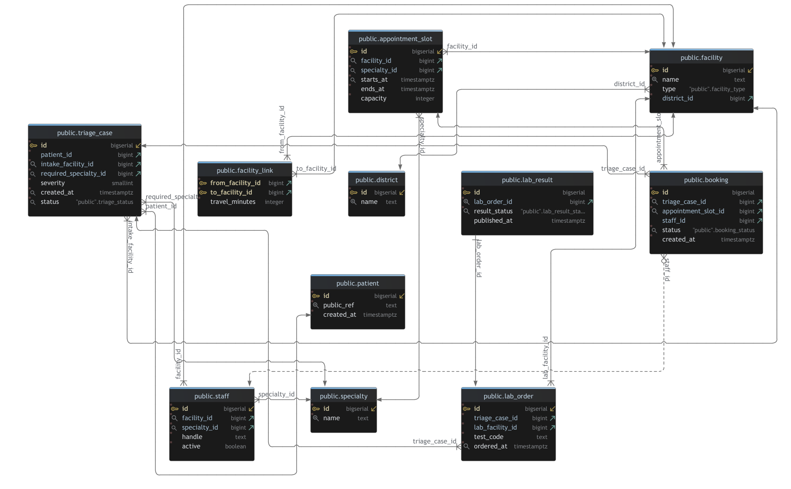

# NeonCare (Spring Boot + Vaadin + jOOQ Demo) 🩺✨

NeonCare is a **Spring Boot REST service** for managing **healthcare appointment slots**, **triage cases**, and **slot suggestions** across facilities.  
It’s built to evolve into a realistic, deployable service that demonstrates **modern Java (25)**, **jOOQ**, and **production-minded engineering**.

A Vaadin UI is a **separate service** that consumes the backend via a stable API contract.

## Data

- PostgreSQL schema + seed data via **Flyway migrations**
- Type-safe SQL via **jOOQ** with code generation

## Tech stack

- Java 25
- Spring Boot 4
- PostgreSQL
- jOOQ (OSS)
- Flyway
- Maven (+ Maven Wrapper)
- Docker Compose for PostgreSQL
- Testcontainers for integration tests
- Vaadin for frontend

### Domain: scheduling & triage

- **Appointment Slots**
    - List slots with basic filtering (facility/specialty/district)
    - Fetch slot by ID
    - Create/update/delete slots
    - Availability logic excludes fully booked slots (and handles cancelled bookings correctly)
- **Scheduling**
    - Suggest slots for a triage case (simple matching logic)
- **Triage**
    - Fetch triage case details by ID
- **Staff**
    - List staff by specialty

## How to run the application

Spin up a database instance:

```shell
docker compose up -d
```

for the backend service, run Flyway migrations to create a schema and seed test data:

```shell
mvn flyway:migrate
```

Then, run code generation with jOOQ:

```shell
mvn jooq-codegen:generate
```

After that, you can run the application:

```shell
mvn spring-boot:run
```

## Schema diagram

